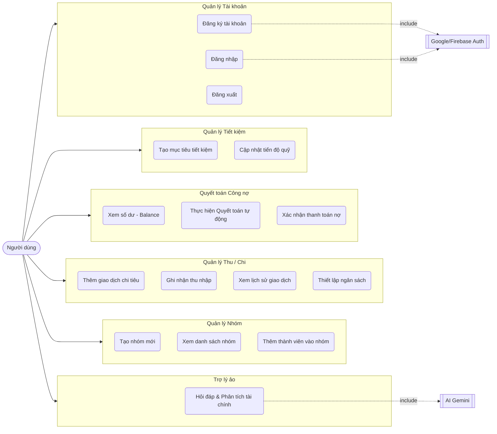

# Sơ đồ Use-case Hệ thống Quản lý Chi tiêu

Sơ đồ dưới đây mô tả các ca sử dụng (Use-case) chính của hệ thống từ góc độ người dùng, bao gồm các cụm chức năng từ quản lý tài khoản, quản lý nhóm, quản lý thu chi, cho đến các tính năng nâng cao như quyết toán công nợ tự động và trợ lý AI.

### Đặc tả các Use-case chính

1. **Quản lý Nhóm:** Người dùng có thể khởi tạo các nhóm chung (nhóm du lịch, nhóm phòng trọ) và mời bạn bè tham gia. Mọi thành viên trong nhóm có quyền bình đẳng trong việc thêm mới chi tiêu.
2. **Quản lý Thu/Chi:** Tính năng cốt lõi cho phép người dùng ghi nhận số tiền, diễn giải, chọn người thanh toán và phân bổ chi phí cho những ai trong nhóm.
3. **Quyết toán Công nợ:** Ứng dụng tự động tính toán tổng số tiền mỗi người đã trả và thực tiêu, sau đó sử dụng thuật toán cấn trừ để tối ưu hóa số vòng chuyển khoản, giúp các thành viên trả nợ lẫn nhau một cách nhanh gọn nhất.
4. **Quản lý Tiết kiệm:** Hỗ trợ thiết lập các mục tiêu tài chính cá nhân (như mua xe, mua nhà) và liên tục theo dõi tiến độ hoàn thành dựa trên số tiền tích lũy.
5. **Trợ lý ảo (AI Gemini):** Người dùng có thể giao tiếp với AI chatbot. AI sẽ truy xuất dữ liệu chi tiêu, thu nhập và tiết kiệm thực tế của người dùng để đưa ra nhận xét, đánh giá và lời khuyên tài chính cá nhân hóa.