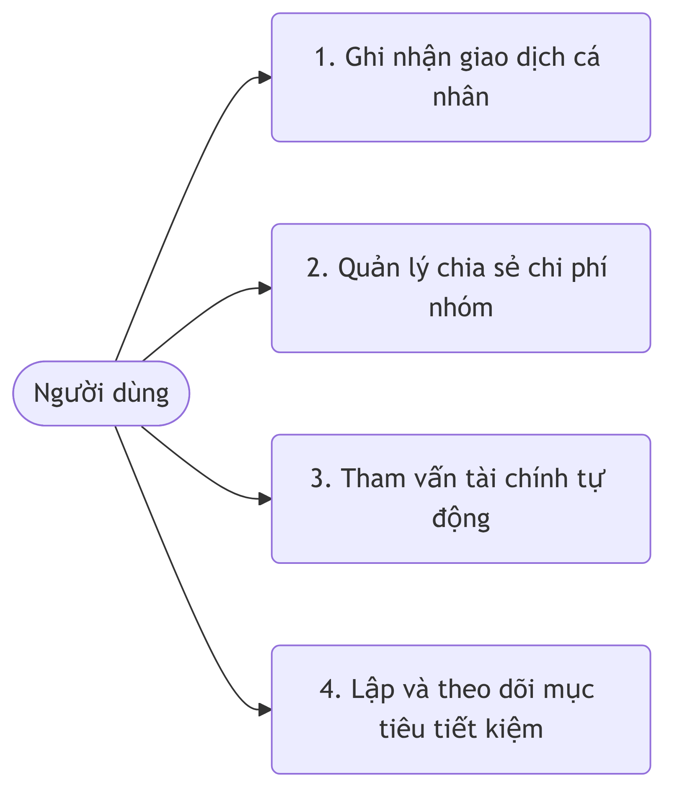
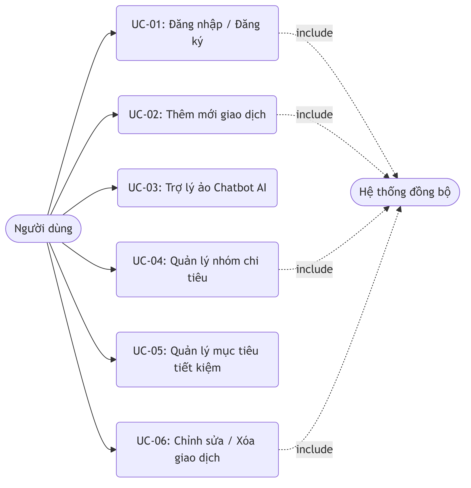
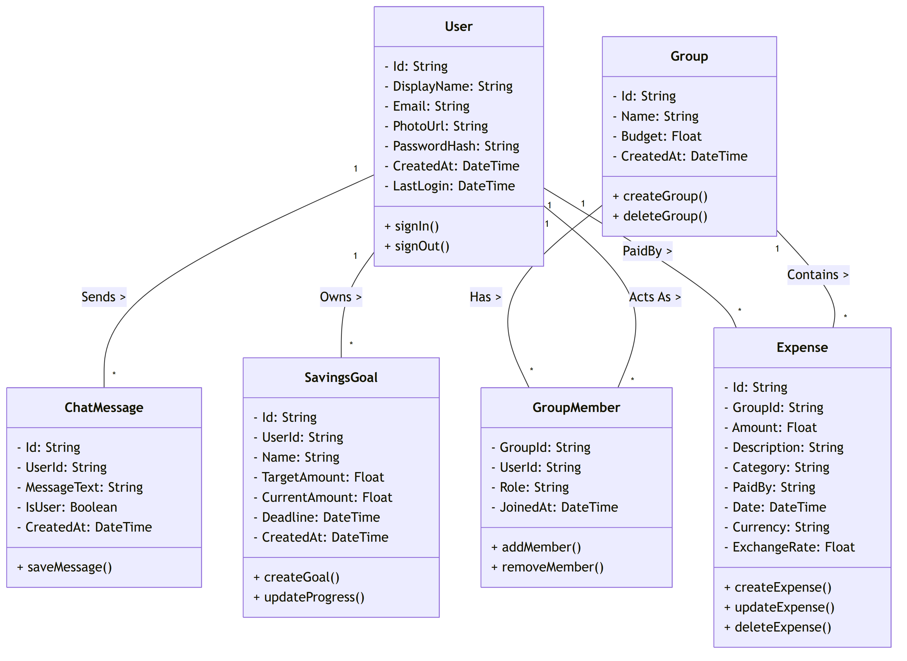
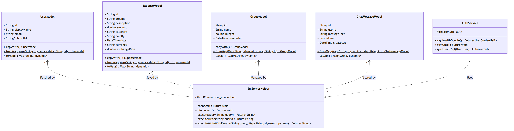

BỘ CÔNG THƯƠNG
**TRƯỜNG ĐẠI HỌC CÔNG THƯƠNG TP. HCM**
**KHOA CÔNG NGHỆ THÔNG TIN**
------

**KHÓA LUẬN TỐT NGHIỆP**

**XÂY DỰNG ỨNG DỤNG QUẢN LÝ CHI TIÊU CÁ NHÂN VÀ NHÓM**
**TÍCH HỢP ĐỒNG BỘ DỮ LIỆU SQL SERVER - FIREBASE**

Ngành: Công Nghệ Thông Tin

**GIẢNG VIÊN HƯỚNG DẪN:**
**ThS Trần Thị Vân Anh**

**SINH VIÊN THỰC HIỆN:**
> 1. *2001225553 -- Nguyễn Minh Trí --13DHTH08*

TP. HỒ CHÍ MINH, tháng 06, năm 2026

# LỜI CẢM ƠN
Lời đầu tiên, em xin gửi lời chào trân trọng và lời cảm ơn chân thành nhất đến Ban Giám hiệu, cùng toàn thể quý thầy cô giáo, cán bộ và công nhân viên đang công tác tại Trường Đại học Công Thương TP.HCM. Cảm ơn nhà trường đã tạo ra một môi trường học tập, rèn luyện chất lượng và truyền đạt cho em những nền tảng kiến thức chuyên môn vững chắc.

Đặc biệt, em xin bày tỏ lòng biết ơn sâu sắc nhất đến Giảng viên hướng dẫn -- ThS Trần Thị Vân Anh. Trong suốt quá trình em nghiên cứu và phát triển đề tài khóa luận "XÂY DỰNG ỨNG DỤNG QUẢN LÝ CHI TIÊU CÁ NHÂN VÀ NHÓM TÍCH HỢP ĐỒNG BỘ DỮ LIỆU SQL SERVER - FIREBASE", cô đã luôn tận tình dành thời gian chỉ bảo, định hướng và đưa ra những lời khuyên chuyên môn vô cùng quý báu.

Mặc dù đã cố gắng hết sức để hoàn thiện khóa luận, nhưng do giới hạn về mặt thời gian cũng như kinh nghiệm, đề tài chắc chắn vẫn còn những thiếu sót. Em rất mong nhận được sự góp ý từ quý thầy cô trong hội đồng.

**Sinh viên thực hiện**
*Nguyễn Minh Trí*

# MỤC LỤC
[Mục lục sẽ được cập nhật tự động bởi Word]

# DANH MỤC CÁC KÝ HIỆU VÀ CHỮ VIẾT TẮT
- CSDL: Cơ sở dữ liệu
- API: Giao diện lập trình ứng dụng
- UI/UX: Giao diện người dùng / Trải nghiệm người dùng
- SQL: Ngôn ngữ truy vấn có cấu trúc
- UUID: Mã định danh duy nhất
- JSON: JavaScript Object Notation

# DANH MỤC HÌNH
[Danh mục hình sẽ được cập nhật tự động bởi Word]

# DANH MỤC BẢNG
[Danh mục bảng sẽ được cập nhật tự động bởi Word]

# MỞ ĐẦU

1. GIỚI THIỆU

Trong bối cảnh xã hội ngày càng phát triển và nhu cầu quản lý tài chính cá nhân cũng như nhóm ngày càng được chú trọng, việc theo dõi dòng tiền thu chi là yếu tố sống còn để duy trì sự ổn định tài chính. Đặc thù của việc quản lý chi tiêu hiện đại là yêu cầu tính minh bạch, khả năng tra cứu nhanh chóng, tính toán số dư tự động và đồng bộ dữ liệu liên tục trên nhiều thiết bị.

Tuy nhiên, thực tế hiện nay cho thấy, việc quản lý sổ sách chi tiêu của nhiều cá nhân, đặc biệt là các nhóm bạn trẻ, sinh viên sống chung hay chia sẻ chi phí du lịch, vẫn đang được thực hiện chủ yếu qua hệ thống giấy tờ thủ công, tin nhắn hoặc các file Excel rải rác. Phương pháp truyền thống này bộc lộ nhiều điểm hạn chế đáng lo ngại. Việc ghi chép và tính toán bù trừ tiền bạc bằng tay dễ dẫn đến những sai sót do yếu tố con người, làm sai lệch số dư thực tế và tiêu tốn một lượng lớn thời gian trong việc đối soát (split bill) vào mỗi cuối tháng. Nhận thấy những rào cản đó, việc số hóa quy trình quản lý chi tiêu thành một ứng dụng di động hoàn chỉnh là một nhu cầu vô cùng cấp thiết. Đó cũng chính là lý do đề tài này được lựa chọn để đi sâu vào nghiên cứu.

2. MỤC TIÊU ĐỀ TÀI

Đề tài được thực hiện nhằm hướng tới các mục tiêu sau:

-   Xây dựng hệ thống đa nền tảng: Phát triển một giải pháp phần mềm toàn diện trên môi trường Mobile (Android/iOS) bằng framework Flutter, cho phép thao tác nhập liệu trực tiếp mọi lúc mọi nơi.
-   Số hóa quy trình tài chính: Chuyển đổi hoàn toàn sổ sách vật lý sang định dạng điện tử, tập trung vào việc lưu vết các khoản thu/chi cá nhân, quản lý các khoản chi chung của nhóm và thiết lập mục tiêu tiết kiệm.
-   Tự động hóa đối soát và thống kê: Tích hợp cơ chế tự động tính toán số dư, vẽ biểu đồ phân tích tỷ trọng các khoản chi tiêu (Pie chart) giúp người dùng nắm bắt tình hình tài chính ngay lập tức.
-   Đảm bảo tính bảo mật và lưu vết: Ứng dụng cơ chế đăng nhập lai (Hybrid Authentication) giữa Firebase và Microsoft SQL Server, đảm bảo mọi thao tác đều được lưu vết, danh tính người dùng được đồng bộ và mã hóa an toàn trên máy chủ.

3. ĐỐI TƯỢNG VÀ PHẠM VI ĐỀ TÀI

Đối tượng nghiên cứu: Đề tài tập trung phân tích và thiết kế quy trình lưu chuyển dòng tiền. Các đối tượng bao gồm nhóm giao dịch tài chính (hoạt động chi, hoạt động thu), đối tượng người dùng (cá nhân, thành viên nhóm), và đối tượng quản trị mục tiêu (mục tiêu tiết kiệm, quỹ dự phòng).

Phạm vi nghiệp vụ: Hệ thống được giới hạn trong việc giải quyết bài toán ghi nhận giao dịch, quản lý nhóm chi tiêu (Tạo nhóm, mời thành viên, xem quỹ chung), tư vấn tài chính qua trợ lý ảo (Chatbot AI) và tính toán thống kê. Đề tài chưa bao gồm việc tích hợp trực tiếp mở rộng với các hệ thống Ngân hàng (Open Banking) hay tự động cấn trừ qua thẻ tín dụng quốc tế.

Phạm vi công nghệ: Đề tài ứng dụng kiến trúc phần mềm linh hoạt MVC/MVVM, sử dụng công nghệ phát triển Mobile (Flutter) hiện đại kết hợp cùng hệ quản trị cơ sở dữ liệu quan hệ chuyên dụng Microsoft SQL Server (triển khai trên Docker) để lưu trữ và xử lý dữ liệu với hiệu năng cao.

# CHƯƠNG 1: KHẢO SÁT HỆ THỐNG

## 1.1. MỤC TIÊU KHẢO SÁT

Mục đích chính của bước khảo sát là tìm hiểu cách thức quản lý thu chi thực tế của cá nhân và đặc biệt là các nhóm có chung quỹ sinh hoạt (nhóm sinh viên phòng trọ, gia đình). Từ những dữ liệu thu thập được, đề tài sẽ tiến hành ánh xạ các thông số quan trọng như hạn mức chi tiêu, chu kỳ tính toán, và cách thức đóng góp vào mô hình dữ liệu của hệ thống, đảm bảo phần mềm phản ánh chính xác nghiệp vụ thực tiễn và thói quen của người tiêu dùng hiện đại.

## 1.2. HIỆN TRẠNG TỔ CHỨC VÀ QUY TRÌNH NGHIỆP VỤ

### 1.2.1. Cơ cấu tổ chức

Để đáp ứng yêu cầu quản lý chi tiêu cá nhân và tập thể một cách minh bạch, tránh xung đột quyền lợi và giảm thiểu rủi ro mâu thuẫn tiền bạc, quy trình quản lý đòi hỏi một cơ chế phân quyền rõ ràng trong hệ thống nhóm. Cụ thể, cấu trúc phân quyền được chia thành các vai trò cốt lõi như sau:

-   Người dùng cá nhân (Individual User): Là người tạo ra dữ liệu, sở hữu không gian thu chi độc lập, không bị can thiệp bởi bất kỳ ai khác vào sổ sách cá nhân của mình.
-   Trưởng nhóm (Group Admin): Đảm nhiệm việc khởi tạo nhóm chi tiêu chung, thiết lập tên nhóm, cấu hình ngân sách ban đầu và có quyền mời thành viên (Members) tham gia vào nhóm của mình.
-   Thành viên nhóm (Group Member): Là những người tham gia vào một quỹ chung. Họ có quyền trực tiếp khai báo các khoản đã chi tiêu thay cho nhóm (ví dụ: mua đồ ăn, trả tiền điện) và cập nhật kết quả vào quỹ chung để hệ thống tự động bù trừ, chia đều chi phí.

### 1.2.2. Đặc tả Quy trình nghiệp vụ Quản lý Chi tiêu

Dựa vào cách quản lý thực tiễn, quy trình vật lý được mô hình hóa vào hệ thống phần mềm thông qua các điểm kiểm soát sau:

-   Kiểm tra danh tính và đăng nhập: Trước khi bắt đầu bất kỳ thao tác nào, người dùng bắt buộc phải xác thực danh tính. Việc này được thực hiện qua cổng đăng nhập Google (Firebase). Sau đó, token định danh sẽ được hệ thống phân tích và ánh xạ ngược lại bảng Users trong CSDL SQL Server để đảm bảo người dùng có khoá định danh duy nhất (UUID) trên toàn hệ thống.
-   Công đoạn Nhập liệu khoản chi cá nhân: Quá trình này diễn ra thường xuyên nhất. Sau khi phát sinh giao dịch thực tế, người dùng mở ứng dụng và tiến hành khai báo. Hệ thống yêu cầu bắt buộc nhập số tiền cụ thể (phải lớn hơn 0) và phân loại danh mục (Ăn uống, Giải trí, Hóa đơn,...). Người dùng có quyền tùy chọn nhập thêm ghi chú chi tiết. Dữ liệu ngay lập tức được ghi vào CSDL cục bộ và đồng bộ lên server.
-   Công đoạn Quản lý và xử lý quỹ nhóm: Tại công đoạn này, quy trình phức tạp hơn khi một giao dịch ảnh hưởng đến nhiều người. Người thao tác sẽ đối chiếu số tiền trên bill tính tiền, tiến hành chọn nhóm liên quan trong ứng dụng và khai báo khoản chi. Hệ thống bắt buộc phải gán GroupId và PaidBy (Id của người đã đứng ra trả tiền). Nhờ đó, ứng dụng sẽ thực hiện cập nhật theo thời gian thực (Realtime State Management) để tất cả các thành viên trong nhóm đều nhìn thấy khoản chi này, đảm bảo tính minh bạch.
-   Công đoạn Tư vấn Chatbot AI: Ứng dụng cung cấp một tính năng Chatbot AI để tư vấn tài chính. Người dùng có thể đặt câu hỏi về chi tiêu, nhận lời khuyên hoặc tra cứu thông tin. Hệ thống sẽ lưu trữ lịch sử tương tác giữa người dùng và AI trong cơ sở dữ liệu. Bất kỳ thắc mắc nào về quản lý tài chính đều có thể được giải đáp thông qua trợ lý ảo này.

## 1.3. KẾT CHƯƠNG

Chương 1 đã hoàn thành mục tiêu khảo sát và làm rõ hiện trạng nhu cầu cũng như quy trình nghiệp vụ thực tế của bài toán quản lý chi tiêu. Qua đó, đề tài đã xác định được cấu trúc người dùng và phân quyền rõ ràng nhằm tuân thủ nguyên tắc minh bạch, bao gồm các vai trò nòng cốt: Cá nhân độc lập, Trưởng nhóm và Thành viên nhóm. Đồng thời, quá trình khảo sát cũng đã đặc tả chi tiết các luồng xử lý chính trong quy trình, từ bước xác thực hệ thống cho đến công đoạn khai báo chi tiêu, quản lý ngân sách tập thể và trợ lý ảo Chatbot AI.

Những dữ liệu thực tiễn và các yêu cầu vận hành thu thập được trong chương này đóng vai trò là nền tảng cốt lõi. Dựa trên những thông tin này, đề tài đã có đủ cơ sở vững chắc để tiến hành ánh xạ các yêu cầu nghiệp vụ vào mô hình dữ liệu. Đây sẽ là tiền đề mang tính quyết định để bước sang Chương 2, nơi tập trung vào việc phân tích và thiết kế hệ thống, nhằm hiện thực hóa một giải pháp ứng dụng di động quản lý tài chính toàn diện, vận hành tối ưu và đáp ứng tuyệt đối nhu cầu của người dùng.

# CHƯƠNG 2: PHÂN TÍCH HỆ THỐNG

## 2.1. GIỚI THIỆU

Chương này đi sâu vào việc phân tích chi tiết các yêu cầu hệ thống đã được đúc kết từ quá trình khảo sát ở Chương 1. Việc phân tích bao gồm việc lập mô hình hóa nghiệp vụ để hiểu rõ luồng công việc, mô hình hóa chức năng để định hình các Use Case cốt lõi, và xây dựng sơ đồ lớp mức phân tích để tạo nền tảng cho kiến trúc phần mềm. Đây là bước đệm quan trọng giúp chuyển đổi các nhu cầu thực tiễn thành các đặc tả kỹ thuật rõ ràng.

## 2.2. MÔ HÌNH HÓA NGHIỆP VỤ

### 2.2.1. Sơ đồ Use-case nghiệp vụ

Hệ thống quản lý chi tiêu được mô hình hóa với các tác nhân (Actor) chính tham gia vào quy trình nghiệp vụ:

-   **Người dùng (User):** Là đối tượng trung tâm của ứng dụng. Người dùng thực hiện các hành động trực tiếp như đăng nhập, ghi chép giao dịch, xem báo cáo thống kê, tạo/tham gia nhóm chi tiêu, và tương tác với trợ lý ảo Chatbot AI.

### 2.2.2. Mô hình hóa quy trình nghiệp vụ

**1. Ghi nhận giao dịch cá nhân**
- **Use case nghiệp vụ:** Ghi nhận giao dịch cá nhân
- **Use case bắt đầu khi:** Người dùng có nhu cầu lưu lại một khoản thu hoặc chi vừa phát sinh trong thực tế. 
- **Mục tiêu của use case là:** Lưu vết dòng tiền cá nhân một cách chính xác để hệ thống có dữ liệu phân tích thống kê.
- **Các bước cơ bản:**
  1. Người dùng truy cập ứng dụng và vào màn hình Thêm giao dịch.
  2. Người dùng nhập các thông số: Số tiền, Danh mục, Ngày tháng và Ghi chú (nếu có).
  3. Người dùng xác nhận lưu giao dịch.
  4. Hệ thống ghi nhận dữ liệu vào cơ sở dữ liệu và tự động cập nhật lại tổng số dư cũng như biểu đồ thống kê.
- **Các dòng thay thế:**
  - *Tại bước 2:* Nếu người dùng nhập sai định dạng số tiền (hoặc số tiền <= 0), hệ thống sẽ cảnh báo đỏ và yêu cầu nhập lại, không cho phép lưu.

**2. Quản lý chia sẻ chi phí nhóm**
- **Use case nghiệp vụ:** Quản lý chia sẻ chi phí nhóm
- **Use case bắt đầu khi:** Một nhóm người dùng (ví dụ: nhóm bạn đi du lịch, sinh viên ở chung) có phát sinh một khoản chi tiêu chung do một người đứng ra trả trước. 
- **Mục tiêu của use case là:** Tự động chia đều chi phí và tính toán công nợ giữa các thành viên một cách bình đẳng.
- **Các bước cơ bản:**
  1. Người dùng tạo một không gian Nhóm và thêm các thành viên khác vào nhóm thông qua email/ID.
  2. Bất kỳ thành viên nào trong nhóm cũng có thể truy cập vào Nhóm và tiến hành thêm Giao dịch nhóm.
  3. Người dùng nhập số tiền, chọn người đã trả tiền (PaidBy) và lưu lại.
  4. Hệ thống tính toán chia đều chi phí cho tất cả thành viên trong nhóm.
  5. Hệ thống hiển thị bảng công nợ (Ai nợ ai bao nhiêu tiền) ngay trên màn hình chi tiết nhóm để mọi người cùng thấy.
- **Các dòng thay thế:**
  - *Tại bước 1:* Nếu người dùng mời một người chưa có tài khoản trên hệ thống, hệ thống sẽ yêu cầu người đó tải app và đăng nhập trước.

**3. Tham vấn tài chính tự động**
- **Use case nghiệp vụ:** Tham vấn tài chính tự động
- **Use case bắt đầu khi:** Người dùng gặp khó khăn trong việc lập kế hoạch chi tiêu hoặc cần lời khuyên về thói quen tài chính. 
- **Mục tiêu của use case là:** Cung cấp các lời khuyên thông minh, phản hồi ngay lập tức để hỗ trợ quyết định tài chính của người dùng thông qua AI.
- **Các bước cơ bản:**
  1. Người dùng mở giao diện Chatbot AI trong ứng dụng.
  2. Người dùng nhập câu hỏi (ví dụ: "Làm sao để tiết kiệm tiền ăn tháng này?").
  3. Hệ thống gửi câu hỏi đến dịch vụ AI.
  4. AI xử lý, sinh ra lời khuyên phù hợp và hệ thống hiển thị câu trả lời lên màn hình dạng bong bóng chat.
- **Các dòng thay thế:**
  - *Tại bước 3:* Nếu hệ thống mất kết nối mạng, Chatbot sẽ hiển thị thông báo lỗi kết nối và yêu cầu người dùng thử lại sau.

**4. Lập và theo dõi mục tiêu tiết kiệm**
- **Use case nghiệp vụ:** Lập và theo dõi mục tiêu tiết kiệm
- **Use case bắt đầu khi:** Người dùng muốn để dành một khoản tiền cho mục đích cụ thể (ví dụ: Mua xe, Đi du lịch). 
- **Mục tiêu của use case là:** Giúp người dùng tạo mục tiêu và theo dõi tiến độ tích lũy theo thời gian.
- **Các bước cơ bản:**
  1. Người dùng truy cập chức năng Mục tiêu tiết kiệm và chọn "Tạo mới".
  2. Người dùng nhập tên mục tiêu, số tiền cần đạt và ngày đến hạn.
  3. Hệ thống lưu mục tiêu và khởi tạo tiến độ ở mức 0%.
  4. Hàng tuần/tháng, người dùng cập nhật số tiền đã tích lũy thêm.
  5. Hệ thống tính toán lại % hoàn thành và hiển thị thanh tiến độ (Progress bar).
- **Các dòng thay thế:**
  - *Tại bước 4:* Nếu số tiền tích lũy vượt quá mục tiêu, hệ thống sẽ chúc mừng người dùng đã hoàn thành mục tiêu sớm hạn.

## 2.3. MÔ HÌNH HÓA CHỨC NĂNG

### 2.3.1. Sơ đồ Use Case hệ thống

Dựa trên nghiệp vụ, hệ thống bao gồm các Use Case cốt lõi sau:
1. Đăng nhập / Đăng ký
2. Thêm mới giao dịch thu/chi
3. Chỉnh sửa / Xóa giao dịch
4. Quản lý mục tiêu tiết kiệm
5. Quản lý Nhóm (Tạo, Thêm/Xóa thành viên)
6. Trợ lý ảo Chatbot AI

### 2.3.2. Đặc tả Use Case hệ thống

**Đặc tả UC-01: Đăng nhập bằng Google (Hybrid Auth)**
- **Mô tả:** Cho phép người dùng sử dụng tài khoản Google để đăng nhập, hệ thống sẽ đồng bộ thông tin xác thực xuống SQL Server.
- **Tác nhân:** Người dùng.
- **Tiền điều kiện:** Thiết bị có kết nối mạng internet.
- **Luồng sự kiện chính:** 
  1. Người dùng bấm nút "Đăng nhập với Google".
  2. Ứng dụng chuyển hướng sang giao diện xác thực của Google Firebase.
  3. Người dùng chọn tài khoản và cấp quyền.
  4. Firebase trả về UID và thông tin (Email, Tên, Ảnh đại diện).
  5. Ứng dụng gọi dịch vụ SQL Server (hàm `_syncUserToSql`) để kiểm tra. Nếu UID chưa tồn tại, thêm mới vào bảng `Users`; nếu đã có, tiến hành cập nhật thông tin mới nhất.
  6. Hệ thống chuyển hướng người dùng vào màn hình chính (Dashboard).

**Đặc tả UC-02: Thêm mới giao dịch chi tiêu**
- **Mô tả:** Ghi nhận một khoản chi tiêu mới vào hệ thống.
- **Tác nhân:** Người dùng.
- **Tiền điều kiện:** Người dùng đã đăng nhập thành công.
- **Luồng sự kiện chính:**
  1. Người dùng chọn biểu tượng "Thêm giao dịch" (+).
  2. Hệ thống hiển thị biểu mẫu (Form) nhập liệu.
  3. Người dùng nhập số tiền (bắt buộc > 0), chọn danh mục chi tiêu, nhập ghi chú, chọn nhóm liên quan (nếu là chi tiêu chung).
  4. Người dùng nhấn nút "Lưu".
  5. Hệ thống gọi phương thức `executeWriteWithParams` truyền tham số vào truy vấn SQL để lưu vào bảng `Expenses`.
  6. Hệ thống cập nhật lại biểu đồ thống kê và hiển thị thông báo thành công.
- **Luồng ngoại lệ:** Nếu số tiền để trống hoặc bằng 0, hệ thống báo lỗi đỏ tại trường nhập liệu và chặn thao tác lưu.

**Đặc tả UC-03: Trợ lý ảo Chatbot AI**
- **Mô tả:** Cho phép người dùng trao đổi với AI để được tư vấn tài chính.
- **Tác nhân:** Người dùng.
- **Luồng sự kiện chính:**
  1. Người dùng truy cập vào màn hình Chatbot AI.
  2. Người dùng nhập nội dung câu hỏi vào ô tin nhắn và nhấn gửi.
  3. Hệ thống gửi truy vấn đến dịch vụ AI, đồng thời lưu tin nhắn của người dùng vào bảng `ChatMessages` (`IsUser = 1`).
  4. Hệ thống nhận phản hồi từ AI, hiển thị lên màn hình và lưu tin nhắn phản hồi vào bảng `ChatMessages` (`IsUser = 0`).

## 2.4 SƠ ĐỒ LỚP MỨC PHÂN TÍCH

Hệ thống được tổ chức với các lớp thực thể (Entity) đóng vai trò chứa dữ liệu và các lớp điều khiển (Controller/Provider) xử lý logic.
- **Lớp UserModel:** Lưu trữ ID, DisplayName, Email.
- **Lớp ExpenseModel:** Chứa Amount, Description, Date, Category, GroupId.
- **Lớp GroupModel:** Chứa thông tin ngân sách (Budget) và danh sách Member.
- **Lớp SqlServerHelper:** Quản lý kết nối TCP/IP trực tiếp đến container Docker chứa CSDL. Đảm bảo luồng dữ liệu an toàn.

## 2.5 KẾT CHƯƠNG

Chương 2 đã thực hiện phân tích chi tiết hệ thống phần mềm Quản lý chi tiêu, từ việc định hình mô hình nghiệp vụ cho tới việc đặc tả chức năng chi tiết thông qua các Use Case cốt lõi. Sơ đồ lớp mức phân tích cũng đã bước đầu phác thảo được cấu trúc dữ liệu và mối quan hệ giữa các thành phần thực thể trong hệ thống. Những kết quả phân tích này là cơ sở trực tiếp và nền tảng vững chắc để tiến tới quá trình thiết kế chi tiết CSDL và cấu trúc mã nguồn trong Chương 3.

# CHƯƠNG 3: THIẾT KẾ HỆ THỐNG

## 3.1. Sơ đồ lớp thiết kế

Quá trình thiết kế hệ thống chuyển hóa các kết quả phân tích thành các mô hình kỹ thuật chi tiết. Sơ đồ lớp thiết kế đóng vai trò định hướng cho việc tổ chức mã nguồn trong môi trường Flutter, đồng thời ánh xạ trực tiếp các thuộc tính xuống bảng dữ liệu của SQL Server.

### 3.1.1. Đặc tả lớp thiết kế

-   **Lớp AuthService:** Xử lý xác thực người dùng. Bao gồm các phương thức `signInWithGoogle()`, `signOut()`. Lớp này giao tiếp trực tiếp với Firebase Auth để nhận token và sau đó gọi `_syncUserToSql()` để đồng bộ thông tin.
-   **Lớp SqlServerHelper:** Triển khai theo mẫu thiết kế Singleton để đảm bảo chỉ có duy nhất một kết nối (Connection) được mở đến cơ sở dữ liệu. Nó bao gồm các hàm cốt lõi như `connect()`, `executeWrite(String query)` và đặc biệt là `executeWriteWithParams(String query, Map<String, dynamic> params)` nhằm phòng ngừa rủi ro SQL Injection.
-   **Lớp ExpenseNotifier (State Management):** Kế thừa từ `StateNotifier` của thư viện Riverpod. Lớp này chứa danh sách các `ExpenseModel`. Các hành động `addExpense()`, `deleteExpense()` sẽ trực tiếp thay đổi trạng thái (State) và kích hoạt việc vẽ lại giao diện (Rebuild UI).
-   **Các lớp Data Model (UserModel, ExpenseModel, GroupModel...):** Chứa các thuộc tính ánh xạ 1:1 với các trường trong SQL Server. Mỗi Model đều bắt buộc cài đặt hai hàm `toMap()` và `fromMap()` để tuần tự hóa và giải tuần tự hóa dữ liệu JSON nhận được từ cơ sở dữ liệu.

### 3.1.2 Ràng buộc toàn vẹn

Để đảm bảo dữ liệu trong hệ quản trị SQL Server luôn chính xác, các ràng buộc toàn vẹn (Integrity Constraints) được thiết lập chặt chẽ:
-   **Ràng buộc khóa chính (Primary Key):** Mọi bảng (Users, Expenses, Groups, ChatMessages) đều sử dụng `Id` kiểu chuỗi (NVARCHAR(50)) chứa UUID làm khóa chính, đảm bảo tính duy nhất trên toàn cục.
-   **Ràng buộc khóa ngoại (Foreign Key):**
    -   `UserId` trong bảng `ChatMessages` và `SavingsGoals` phải tồn tại trong bảng `Users`.
    -   `GroupId` trong bảng `Expenses` và `GroupMembers` phải tồn tại trong bảng `Groups`.
    -   Việc xóa dữ liệu cha sẽ được thiết lập cơ chế `ON DELETE CASCADE` (ví dụ xóa nhóm thì tự động xóa thành viên nhóm đó) hoặc báo lỗi bảo vệ dữ liệu.
-   **Ràng buộc miền giá trị (Check Constraint):** Thuộc tính `Amount` (Số tiền) trong bảng `Expenses` và `SavingsGoals` bắt buộc phải là số dương (> 0).

## 3.2. Mô hình dữ liệu

Dựa trên các thực thể đã phân tích, cơ sở dữ liệu `QuanLyChiTieuDB` được thiết kế với các bảng chính như sau:

**1. Bảng Users (Người dùng):**
-   `Id` (NVARCHAR(50), PK): Mã định danh (Google UID).
-   `DisplayName` (NVARCHAR(100)): Tên hiển thị của người dùng.
-   `Email` (NVARCHAR(100)): Địa chỉ hòm thư (Unique).
-   `PasswordHash` (NVARCHAR(255)): Chuỗi mã hóa dự phòng (Nullable).

**2. Bảng Groups (Nhóm chi tiêu):**
-   `Id` (NVARCHAR(50), PK): Mã định danh nhóm (UUID).
-   `Name` (NVARCHAR(100)): Tên nhóm.
-   `Budget` (FLOAT): Ngân sách tối đa của nhóm.
-   `CreatedAt` (DATETIME): Thời gian lập nhóm.

**3. Bảng GroupMembers (Thành viên nhóm):**
-   `GroupId` (NVARCHAR(50), PK, FK): Mã nhóm.
-   `UserId` (NVARCHAR(50), PK, FK): Mã thành viên.
-   Bảng này giải quyết mối quan hệ nhiều-nhiều giữa User và Group.

**4. Bảng Expenses (Giao dịch chi tiêu):**
-   `Id` (NVARCHAR(50), PK): Mã giao dịch.
-   `GroupId` (NVARCHAR(50), FK): Nhóm phát sinh chi tiêu (Nullable nếu chi cá nhân).
-   `Amount` (FLOAT): Số tiền giao dịch.
-   `Description` (NVARCHAR(MAX)): Ghi chú.
-   `Category` (NVARCHAR(50)): Phân loại (Ăn uống, Giải trí...).
-   `PaidBy` (NVARCHAR(50), FK): Người thanh toán khoản tiền này.
-   `Date` (DATETIME): Ngày giờ phát sinh.

**5. Bảng ChatMessages (Tin nhắn):**
-   `Id` (NVARCHAR(50), PK): Mã tin nhắn.
-   `UserId` (NVARCHAR(50), FK): Mã người dùng (Người nhắn).
-   `MessageText` (NVARCHAR(MAX)): Nội dung văn bản.
-   `IsUser` (BIT): Đánh dấu tin nhắn của người dùng (1) hay của AI (0).
-   `CreatedAt` (DATETIME): Mốc thời gian gửi.

## 3.3. Thiết kế mô hình 3 lớp

Ứng dụng Flutter được thiết kế bám sát kiến trúc phần mềm 3 lớp (3-Tier Architecture) giúp tách biệt rõ ràng giữa Giao diện, Xử lý logic và Dữ liệu:

### 3.3.1. Tầng Giao diện (Presentation Layer)
Chứa các thành phần UI (Widgets) như màn hình Đăng nhập, Dashboard biểu đồ, danh sách chi tiêu. Tầng này không chứa logic tính toán mà chỉ lắng nghe (Listen) sự thay đổi trạng thái từ tầng Logic bằng Riverpod. Nó nhận thao tác chạm (Tap), nhập liệu (Input) của người dùng và chuyển yêu cầu xuống dưới.

### 3.3.2. Tầng Logic Nghiệp vụ (Business Logic Layer)
Gồm các Provider và Notifier (ví dụ `ExpenseNotifier`, `AuthNotifier`). Tại đây chứa các quy tắc nghiệp vụ như kiểm tra tính hợp lệ của số tiền nhập vào, tính toán tổng số dư ngân sách hiện tại, và ra quyết định gọi phương thức thêm, sửa, xóa dữ liệu. Tầng này sẽ định dạng tham số và truyền xuống tầng Dữ liệu.

### 3.3.3. Tầng Truy cập Dữ liệu (Data Access Layer)
Đây là tầng dưới cùng, nơi lớp `SqlServerHelper` hoạt động. Nhiệm vụ duy nhất của nó là nhận các câu lệnh SQL từ tầng Logic, chuyển đổi các tham số (Parameterized Data) thành chuỗi truy vấn an toàn và giao tiếp trực tiếp với Microsoft SQL Server thông qua cổng TCP (Port 1434). Sau khi nhận được kết quả (ResultSet), nó sẽ ánh xạ thành danh sách các đối tượng Model và trả ngược lên trên.

# CHƯƠNG 4: CÀI ĐẶT HỆ THỐNG

## 4.1. Công cụ và môi trường phát triển

Quá trình xây dựng và triển khai ứng dụng sử dụng các công cụ hiện đại và tiên tiến nhất:
-   **Ngôn ngữ lập trình:** Dart (cho Frontend), SQL (cho Backend).
-   **Framework:** Flutter SDK (Hỗ trợ biên dịch chéo nền tảng iOS/Android).
-   **Hệ quản trị CSDL:** Microsoft SQL Server 2022.
-   **Môi trường triển khai:** Docker Container (Chạy SQL Server cục bộ trên Linux).
-   **IDE:** Visual Studio Code với các extension hỗ trợ Flutter và mssql.
-   **Quản lý phiên bản:** Git và GitHub.

## 4.2. Tổ chức mã nguồn

Mã nguồn dự án được tổ chức theo cấu trúc Feature-First kết hợp MVVM, giúp dự án dễ bảo trì và mở rộng trong tương lai. Cấu trúc thư mục cốt lõi bao gồm:

-   `lib/core/`: Chứa các thành phần dùng chung toàn hệ thống như màu sắc, theme, và các Services (`sql_server_helper.dart`).
-   `lib/features/`: Phân chia theo từng chức năng riêng biệt.
    -   `auth/`: Xử lý đăng nhập Firebase và đồng bộ thông tin tài khoản.
    -   `expenses/`: Quản lý danh sách chi tiêu, biểu đồ, thêm giao dịch.
    -   `groups/`: Quản lý tạo nhóm, thêm thành viên.
    -   `chat/`: Quản lý giao diện và logic tương tác với Chatbot AI.

## 4.3. Cài đặt chức năng cốt lõi

### 4.3.1. Cài đặt cơ chế Hybrid Auth

Cơ chế xác thực là sự kết hợp giữa hệ sinh thái Google và Server nội bộ.
Khi ứng dụng khởi động, Stream `FirebaseAuth.instance.authStateChanges()` sẽ lắng nghe trạng thái đăng nhập. Ngay khi có User hợp lệ, hàm `_syncUserToSql(User user)` được gọi. Hàm này sử dụng câu lệnh `IF NOT EXISTS` của T-SQL để chèn người dùng mới vào bảng `Users` dựa trên UUID. Nếu đã tồn tại, nó sẽ `UPDATE` lại thông tin phòng trường hợp người dùng đổi tên trên Google.

### 4.3.2. Cài đặt tính năng Thêm chi tiêu (CRUD)

Tại giao diện `AddExpenseScreen`, khi người dùng nhấn "Lưu", một hàm `executeWriteWithParams` được kích hoạt. Điểm mấu chốt là việc sử dụng tham số hóa (Parameterized queries) thông qua thư viện `mssql_connection` để ngăn chặn các cuộc tấn công SQL Injection. Ví dụ:
`INSERT INTO Expenses (Id, Amount, Description, Category, Date) VALUES (@id, @amount, @desc, @cat, @date)`

### 4.3.3. Cài đặt Chức năng Chatbot AI

Giao diện Chatbot được thiết kế với khung chat Bong bóng (Chat Bubbles). Khi người dùng gửi câu hỏi, ứng dụng sẽ lưu tin nhắn (với `IsUser = 1`) vào bảng `ChatMessages` trên SQL Server, đồng thời gửi truy vấn để lấy câu trả lời từ AI. Phản hồi của AI sau đó cũng được lưu vào cơ sở dữ liệu (`IsUser = 0`) và hiển thị trên màn hình, giúp người dùng có lịch sử tư vấn tài chính liên tục và liền mạch.

### 4.3.4. Cài đặt Đồng bộ SQL Server (Docker)

Thay vì cài đặt SQL Server trực tiếp lên hệ điều hành gây nặng máy, hệ thống tận dụng Docker. File `docker-compose.yml` được cấu hình để kéo image `mcr.microsoft.com/mssql/server:2022-latest`. Port nội bộ 1433 được ánh xạ ra port 1434 của máy chủ Linux vật lý (IP: 192.168.100.160) để các thiết bị di động kết nối cùng mạng Wi-Fi có thể dễ dàng truy cập.

## 4.4. Cài đặt giao diện

### 4.4.1. Màn hình Đăng nhập
Thiết kế tối giản với một nút "Đăng nhập bằng Google" nằm ở trung tâm. Sau khi bấm, hộp thoại chuẩn của Google hiện lên để người dùng chọn tài khoản. Logo ứng dụng và Slogan được bố trí ở nửa trên màn hình.

### 4.4.2. Màn hình Dashboard và Thống kê
Đây là trái tim của ứng dụng. Nửa trên là biểu đồ hình quạt (PieChart) được vẽ bằng thư viện `fl_chart`, trực quan hóa tỷ trọng chi tiêu của tháng (Ví dụ: Ăn uống chiếm 50%, Di chuyển 20%). Nửa dưới là danh sách các giao dịch gần đây, sắp xếp theo thời gian giảm dần bằng Widget `ListView.builder`. Người dùng có thể vuốt (Swipe to dismiss) để xóa giao dịch.

## 4.5. KỊCH BẢN KIỂM THỬ (TEST CASES)

Quá trình kiểm thử được thực hiện khắt khe nhằm đảm bảo phần mềm hoạt động đúng thiết kế.

| TC_ID | Chức năng | Hành động kiểm thử | Kết quả mong đợi | Đánh giá |
|---|---|---|---|---|
| TC01 | Đăng nhập | Không có kết nối mạng và ấn Đăng nhập Google | Hệ thống báo lỗi "Không có kết nối mạng" và không crash. | Đạt |
| TC02 | Đăng nhập | Dùng Google Account hợp lệ | Chuyển vào Dashboard, SQL Server tạo mới row trong bảng Users. | Đạt |
| TC03 | Thêm chi tiêu | Bỏ trống số tiền hoặc nhập chữ số | Nút Lưu bị vô hiệu hóa, Form báo lỗi "Vui lòng nhập số hợp lệ". | Đạt |
| TC04 | Bảo mật SQL | Nhập ghi chú chứa mã độc: `'; DROP TABLE Expenses --` | Lệnh bị vô hiệu hóa do đã dùng Parameter, chuỗi được lưu nguyên văn dưới dạng văn bản bình thường. | Đạt |
| TC05 | Xóa chi tiêu | Vuốt sang trái một giao dịch bất kỳ | Giao dịch biến mất khỏi màn hình, đồng thời dữ liệu trong SQL Server bị xóa vĩnh viễn. Biểu đồ tự tính lại. | Đạt |

# KẾT LUẬN

Đề tài "Xây dựng ứng dụng quản lý chi tiêu cá nhân và nhóm" đã hoàn thành xuất sắc các mục tiêu thiết kế và cài đặt ban đầu. Về mặt kỹ thuật, ứng dụng vận hành mượt mà trên nền tảng di động nhờ sức mạnh của Flutter, dữ liệu được bảo vệ an toàn và truy xuất tốc độ cao qua hệ thống Microsoft SQL Server chạy trên Docker. Về mặt nghiệp vụ, ứng dụng đã giải quyết triệt để bài toán tính toán chia tiền nhóm, giúp người dùng minh bạch hóa các khoản thu chi chung và cá nhân.

Tuy nhiên, do giới hạn về mặt nguồn lực, hệ thống vẫn còn một số điểm cần cải thiện trong tương lai. Kiến trúc kết nối trực tiếp từ App Mobile đến CSDL chỉ thực sự an toàn trong môi trường mạng nội bộ (LAN). Hướng phát triển ưu tiên trong giai đoạn tới là bổ sung một lớp Backend trung gian (như ASP.NET Core API) nhằm xử lý toàn bộ logic truy vấn, qua đó có thể đưa hệ thống lên các nền tảng Cloud public một cách an toàn nhất. Bên cạnh đó, việc tích hợp Trí tuệ nhân tạo (AI) để quét hóa đơn tự động và phân tích xu hướng chi tiêu cũng là những tính năng đầy hứa hẹn.

# TÀI LIỆU THAM KHẢO

[1] Google Developers, "Flutter Documentation: Build apps for any screen," 2026. [Trực tuyến]. Available: https://docs.flutter.dev.
[2] Microsoft, "SQL Server 2022 on Docker Containers," Microsoft Learn, 2026. [Trực tuyến]. Available: https://learn.microsoft.com/en-us/sql/linux/sql-server-linux-docker-container-deployment.
[3] Firebase, "Authenticate Using Google Sign-In on Android/iOS," Firebase Documentation, 2026. [Trực tuyến]. Available: https://firebase.google.com/docs/auth/flutter/google-signin.
[4] Trần Thị Vân Anh, "Tài liệu Hướng dẫn Khóa luận tốt nghiệp (KLCN13)," Đại học Công Thương TP.HCM, 2025.
